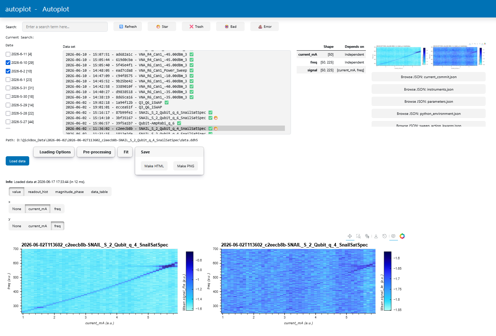

# Autoplot

**Interactive experiment data visualization** — a Panel/HoloViews/Xarray-based GUI for browsing, loading, visualizing, preprocessing, fitting, and exporting experimental datasets.

Extensible to any data type that can be converted to a xarray dataset.




---

## Features

- **File browser** — date-grouped dataset tree with tags (star, trash, bad, error), search/filter, JSON preview, Notes.md editor, image feed, and auto-refresh via watchdog
- **Data loading** — plugin-based loaders for DDH5, NetCDF, and Zarr; auto-detected by file extension
- **Preprocessing pipeline** — chain nodes to split complex numbers, average over dimensions, rotate IQ data
- **Plots** — line/scatter, heatmap/quadmesh, hexbin histograms (complex/IQ), magnitude/phase with unwrapping and delay correction, and data tables
- **Curve fitting** — powered by `lmfit` and labcore fit functions; per-axis fitting with parameter UI, save/load results as JSON
- **Export** — save plots as HTML or PNG, export fit reports as JSON
- **Config-driven** — single YAML file controls server settings, watch directory, loader/plot/fit plugins; CLI overrides available
- **Extensible** — add custom loaders, plot types, preprocessor nodes, or fit functions via the plugin system

---

## Quick start

```bash
# Install
pip install autoplot

# Launch
autoplot -c /path/to/autoplotConfig.yml -d /path/to/data

# Or programmatically
python -c "
from autoplot import make_template, load_config
from pathlib import Path
config = load_config(Path('autoplotConfig.yml'))
template = make_template(config)
template.servable()
"
```

> If no config file exists, a default one is auto-created on first launch.

### CLI reference

| Argument | Default | Description |
|---|---|---|
| `-c`, `--config` | `./autoplotConfig.yml` | Path to config YAML |
| `-d`, `--directory` | *(from config)* | Data directory to watch |
| `--verbose` | — | Enable debug logging |
| `--version` | — | Show version and exit |

Server defaults to `http://127.0.0.1:19530` unless overidden in config (check autoplotConfig_example.yml)

---

## Installation

### From source (development)

```bash
git clone https://github.com/YOUR_USER/autoplot.git
cd autoplot
pip install -e .
```

### Dependencies

Core stack: `panel`, `holoviews`, `hvplot`, `bokeh`, `xarray`, `pandas`, `numpy`, `param`, `lmfit`, `labcore`, `ruamel.yaml`, `watchdog`, `nest_asyncio`.

Development: `pytest`, `pytest-asyncio`.

---

## Architecture overview

```
autoplot/
├── autoplot/
│   ├── cli.py                  # CLI entry point
│   ├── config.py               # YAML config loading, validation, defaults
│   ├── app.py                  # DataSelect widget + app template assembly
│   ├── nodes.py                # Node/Pipeline: preprocessing steps
│   ├── loaders/                # Data loaders (DDH5, NetCDF, Zarr)
│   ├── plots/                  # Plot types (value, complex_hist, magnitude_phase, datatable)
│   └── fits/                   # Fit function registry
├── tests/                      # pytest suite
└── pyproject.toml
```

Data flows through an **imperative pipeline**: `Loader → [Node, ...] → PlotNode`. Each `Node` is a self-contained transformation step with its own UI panel. Plot types, loaders, and fit functions use a **plugin registry** populated from the YAML config so new components can be added without touching core code.

See [`AGENT-GUIDE.md`](AGENT-GUIDE.md) for a detailed architecture guide and extension instructions.

---

## Testing

```bash
python -m pytest tests -v
```

---

## License

[MIT](LICENSE)
